<div align="center">

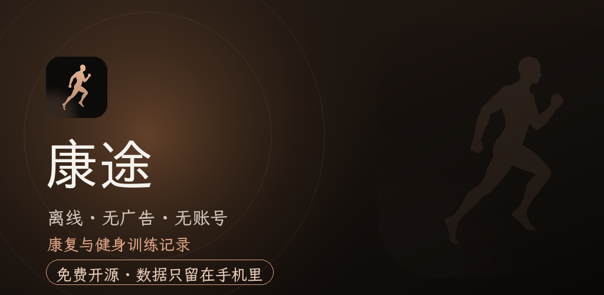

<br/>

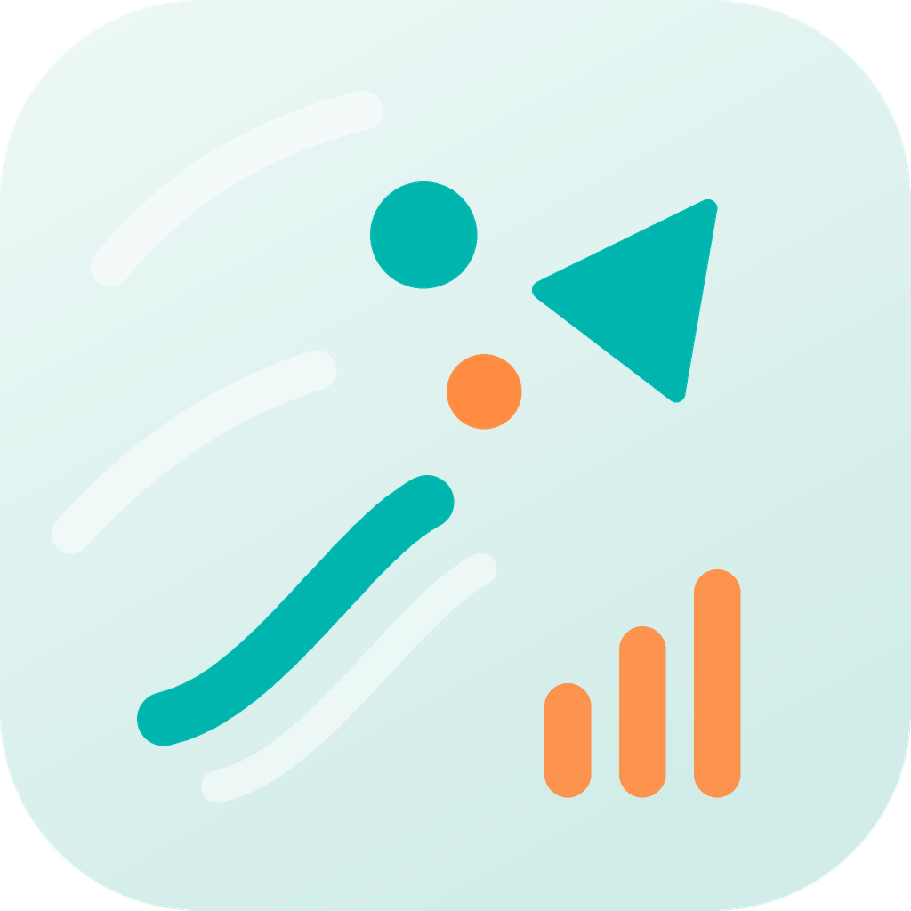

# 康途

一款免费、离线的 Android 康复与健身训练记录应用。<br/>
点选想练的肌群，记录每一组，看着你的数据一路上涨。

<br/>
<br/>

<details>
<summary><sub><b>界面截图</b>，全部来自真机</sub></summary>
<br/>

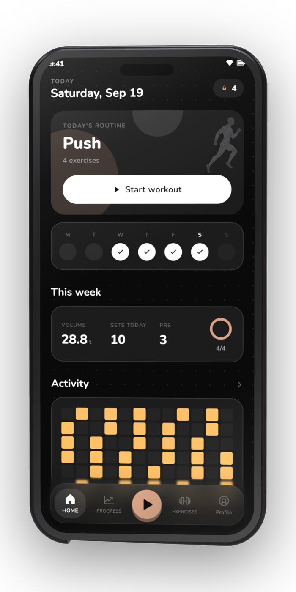
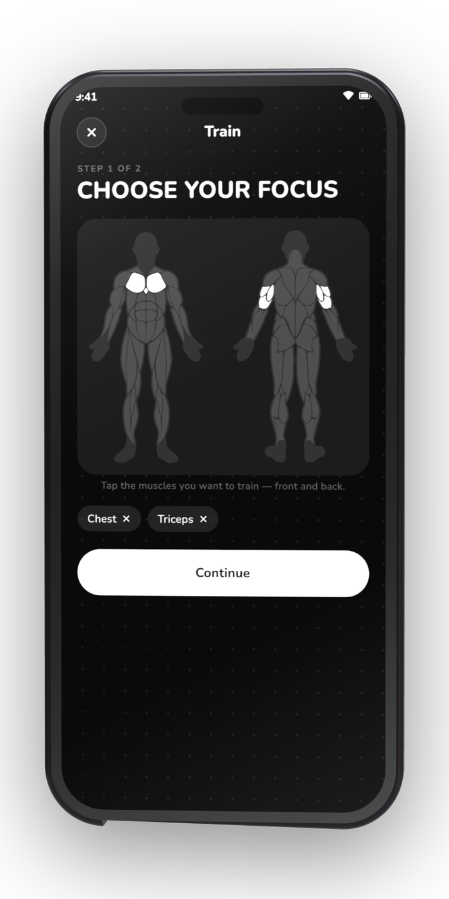
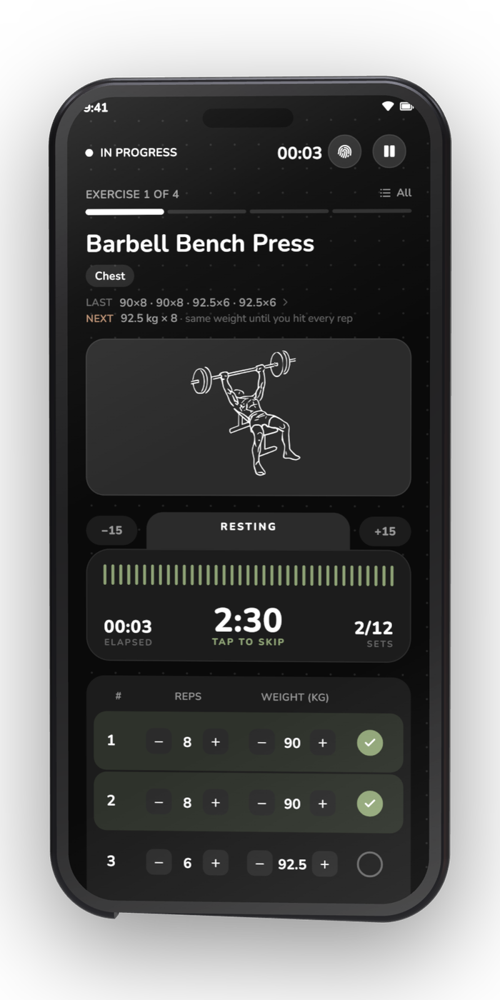
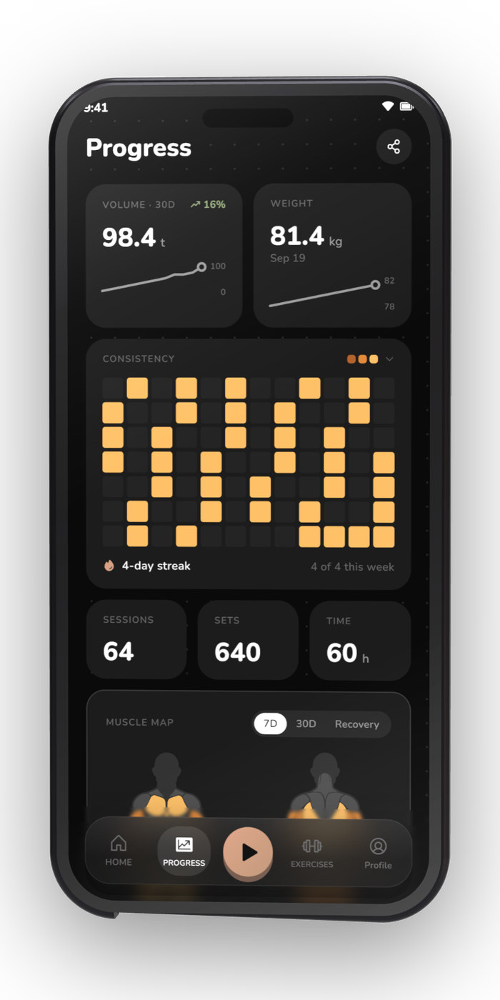

<sub><b>首页</b> &nbsp;·&nbsp; <b>人体图谱</b> &nbsp;·&nbsp; <b>训练进行中</b> &nbsp;·&nbsp; <b>进度统计</b></sub>

<br/>
<br/>

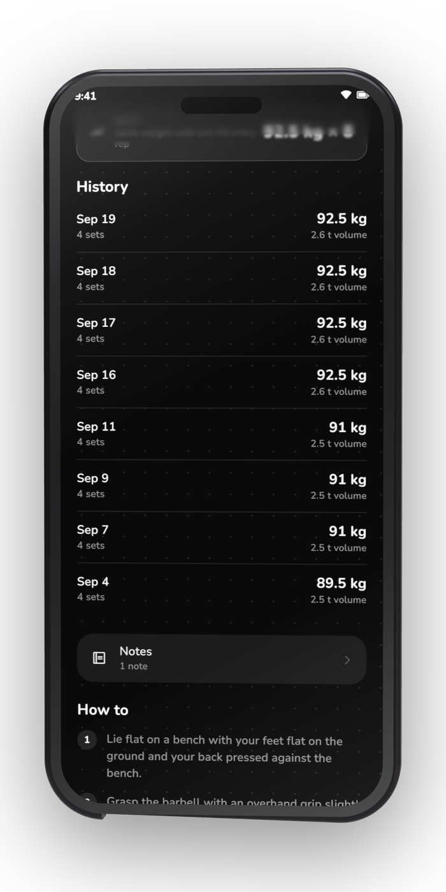
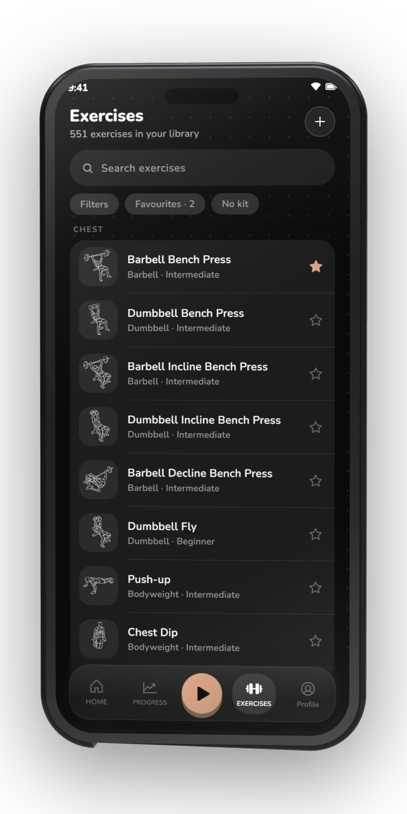
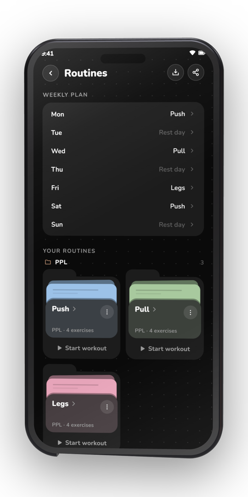
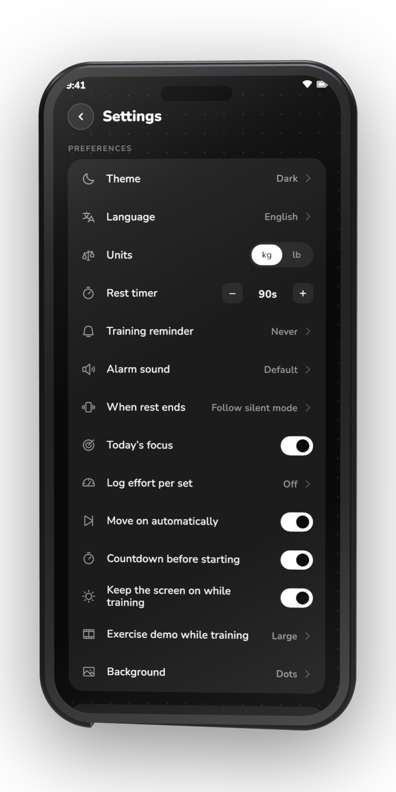

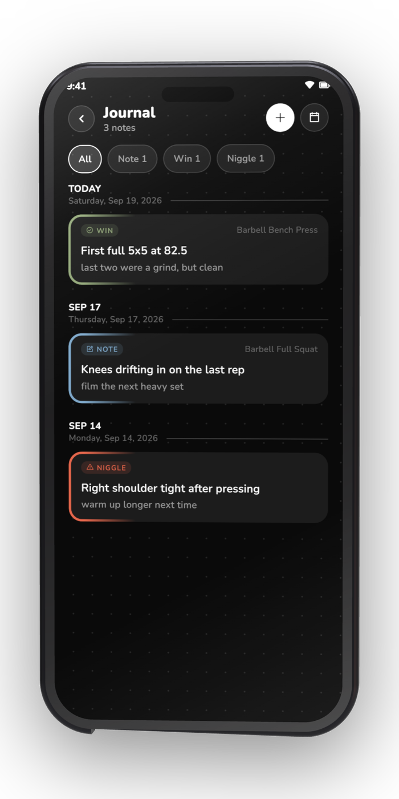
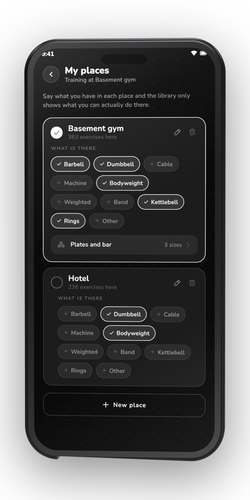
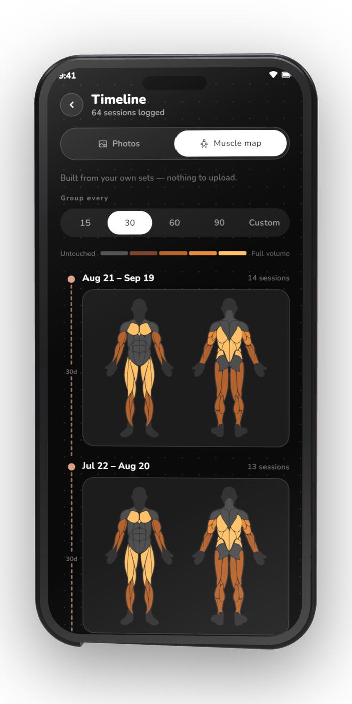
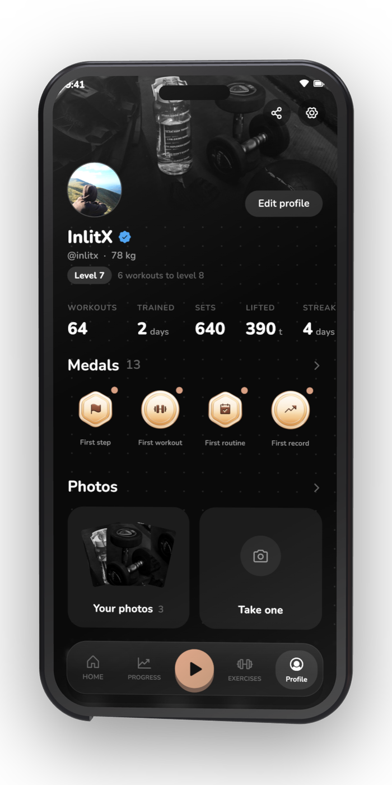

<sub><b>训练历史</b> &nbsp;·&nbsp; <b>动作库</b> &nbsp;·&nbsp; <b>训练计划</b> &nbsp;·&nbsp; <b>设置</b></sub>

</details>

</div>

## 这是什么

康途是一款面向**康复与健身训练**的本地记录应用：在人体图谱上点选想练的肌群，跟着计划完成每一组，
数据全部留在自己的手机上。无账号、无广告、无统计，也不申请网络权限。

本项目基于 [InlitX](https://github.com/InlitX/GymMane) 的 GymMane（GPL-3.0）二次开发，
针对康复训练场景做了中文本地化和功能增强，详细署名见文末[许可证](#许可证)。

## 功能

<table>
<tr>
<td width="50%" valign="top">

### 训练

- **人体图谱**，正面和背面：点一下想练的部位
- 次数、重量，以及可用自定义铃声的**组间休息计时器**
- **组类型**（热身组、正式组、递减组、力竭组），以及 RPE 或 RIR
- **超级组**：把一个动作和下一个串起来，跳过中间的休息
- **每侧配重片**，按你手头的器材自动计算
- 可分组、复制和排期的**训练计划**，一天也可以安排多个，还有现成的方案
- **下一步**：某个动作练得轻松了，就推荐更难的那个
- 带休息倒计时的**实时通知**，手机重启后训练也不会丢失

</td>
<td width="50%" valign="top">

### 康复

- **康复档案**：记录不适部位与程度，训练建议自动避开风险
- **安全门**：命中红旗征时不出训练建议，只做记录并提示就医
- **训练后反馈**：整体感觉 + 不适部位 + 备注，联动康复档案
- **AI 提示词**：导出你的情况交给通用 AI，再把回答导回应用
- 反馈取近 7 天的专业建议公约数，避免单次波动干扰

</td>
</tr>
<tr>
<td width="50%" valign="top">

### 进度

- 训练量、连续打卡、每周目标和**个人纪录**，全部来自你自己的组数
- **活动热力图**、每周节奏和累计总数
- 带 1RM 估算的**力量曲线**，以及肌群分布
- 时间线上的**进度照片**，也可以把同一条时间线画成肌群图
- 体重和**十项身体围度**，每项都有自己的曲线
- 带等级和 **20 枚奖牌**的**个人资料**
- 把训练做成**贴纸**放到照片上分享

</td>
<td width="50%" valign="top">

### 动作与工具

- **500+ 个动作**，配有动画和分步说明
- 按肌群、器材和难度筛选，也能**创建自己的动作**
- 任何动作的插图都可以换成**你自己的照片、GIF 或视频**
- **场地**：告诉它你有哪些器材，只推荐用得上的动作
- 日历形式的**训练日志**，支持照片和视频
- **六个计算器**：1RM、配重片、BMI、热量与宏量营养素、体脂率、热身
- **五个桌面小组件**：今天、本周、活动、统计和肌群图

</td>
</tr>
<tr>
<td width="50%" valign="top">

### 你的数据

- 导出为 **CSV** 或包含照片和视频的完整 **ZIP 备份**，也能再导入回来
- 从 **Hevy**、**Strong**、**Lyfta**、**FitNotes**、**openGym** 或任意 CSV
  导入历史记录
- 把一次训练导出为 `.fit` 文件，上传到 **Strava**
- **AI 训练计划**：导出动作列表，粘贴到任意 AI，再把回答导入
- 无账号、无广告、无统计分析，也没有**网络权限**
- 照片、视频和笔记都保存在应用自己的存储空间里
- **17 种语言**，浅色和深色主题，kg 或 lb
- 一键删除全部数据

</td>
</tr>
</table>

## 下载

从 [GitHub Releases](https://github.com/Howezzzzz/kangtu-rehab/releases) 获取；
如果暂时还没有正式 Release，可以在 [Actions](https://github.com/Howezzzzz/kangtu-rehab/actions)
里下载最新一次构建产出的 APK。不确定选哪个的话，就下载 `arm64-v8a`。

| 平台 | 状态 |
|---|---|
| Android 7.0+ | 已支持 |
| Wear OS 3+ | 开发中 |
| iOS 15+ | 开发中 |
| 桌面端 | 计划中 |

## 隐私

无账号、无广告、无统计分析。康途甚至没有网络权限，你的训练数据只会留在
手机上。它申请的权限只用于休息计时器、计时通知和桌面小组件。

## 参与贡献

欢迎提交问题反馈、想法和 Pull Request。较大的改动请先开一个 issue 讨论。

```bash
git clone https://github.com/Howezzzzz/kangtu-rehab.git
cd kangtu-rehab
flutter pub get
flutter build apk --release
```

## 许可证

代码采用 [GPL-3.0](LICENSE)，并附有其第 7(b) 条规定的一项[附加条款](ADDITIONAL_TERMS.md)：
基于本项目的作品须注明 "Based on GymMane by InlitX"（原文照录，出自上游
InlitX/GymMane）。动作插图来自 Bryl Lim 的
[Workout Guide](https://github.com/bryllim/workout-guide)，以及它所基于的
[Everkinetic](https://github.com/everkinetic/data)，采用
[CC BY-SA 4.0](https://creativecommons.org/licenses/by-sa/4.0/) 许可。字体使用 SIL Open
Font License。详情见 [CREDITS.md](CREDITS.md)。
